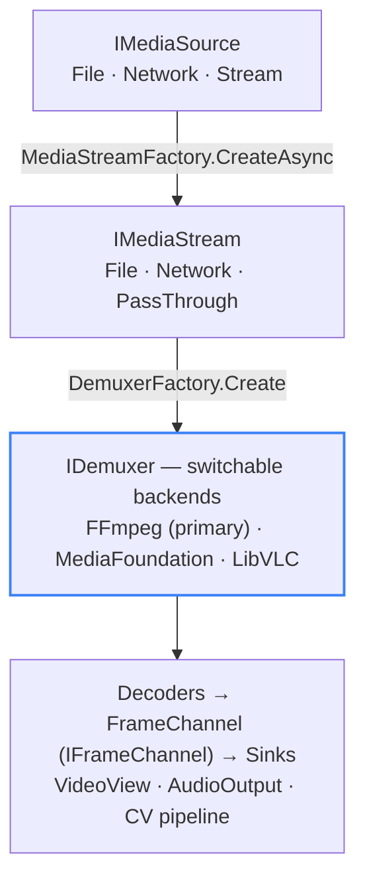
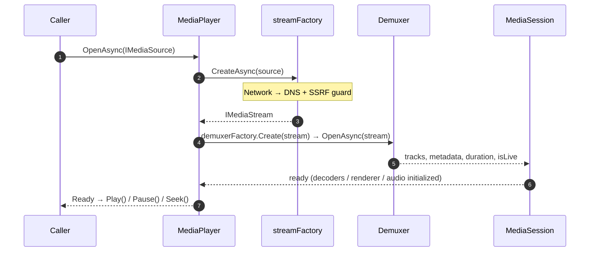

# Backends & Platform Roadmap

LingFan.Media drives playback through **pluggable backends**, all hidden behind the `Abstractions` interfaces. A fallback middleware (`IMediaPlayerFactory`) tries each registered backend in order and switches automatically when one fails. This page maps what is implemented today, what is only scaffolding, and the platform boundaries — including the status of **Linux** (no native backend; playback rides the FFmpeg / VLC cross-platform backends and is tested, with VAAPI hardware decode and Vulkan zero-copy available). For the deployment checklist and playback guide, see **[Linux Deployment & Playback](./linux)**.

## Backend architecture

The pipeline never branches on *which* backend is active; backend selection is an implementation detail resolved by the fallback middleware.

> In plain words: any source becomes an `IMediaStream`, then a demuxer is chosen by the fallback middleware. Decoders emit frames through `IFrameChannel`, and sinks (video view, audio output, CV pipeline) consume them.

## Cross-platform backends (the guarantee)

FFmpeg and LibVLC are the **cross-platform safety net**. Both are LGPL-licensed and run on every target platform — **Windows, Linux, macOS, iOS, and Android** — so playback always works regardless of platform-native support. They are consumed purely through dynamic linking (see [Licensing](./licensing)).

| Backend | License | Platforms | Role | Status |
| --- | --- | --- | --- | --- |
| **FFmpeg** | LGPL 2.1+ (shared build) | Windows, Linux, macOS, iOS, Android | Primary demux / decode via self-written native binding | ✅ Implemented (tested on Windows / Linux) |
| **LibVLC / VLC** | LGPL 2.1+ | Windows, Linux, macOS, iOS, Android | Fallback backend, auto-switched by the middleware | ✅ Implemented (tested on Windows; Linux pending validation) |

Both are tested end-to-end (local file) on Windows today; on Linux the FFmpeg backend is tested (VAAPI hardware decode + Vulkan zero-copy + OpenAL) while LibVLC is pending validation, and both ship for macOS, iOS, and Android. **Linux has no native backend**; all playback there rides the FFmpeg / LibVLC cross-platform backends — the exclusion applies only to building a *native* Linux backend.

## GPU zero-copy capability by backend

Zero-copy means a decoded GPU texture is handed straight to the renderer without a CPU round-trip. Because frame routing is backend-agnostic, the capability depends on whether the decoding backend can surface an importable GPU texture:

| Backend | Hardware decode | GPU zero-copy | Notes |
| --- | --- | --- | --- |
| **FFmpeg** | Yes (Windows: D3D11VA / DXVA2; Linux: VAAPI) | **Yes** (Windows: D3D11, Vulkan, OpenGL; Linux: Vulkan ✅ tested, OpenGL display-dependent) | On Windows, decoded frames are exported as D3D11 shared textures and imported by the renderer — validated including hybrid-GPU systems (the Vulkan device aligns to the D3D11 adapter). On Linux, hardware decode runs through VAAPI, the exported dma_buf (fenced with `vaSyncSurface` before export) is imported zero-copy by the Vulkan renderer — tested — and renderer/decoder GPU vendor alignment happens automatically (cross-vendor imports are not supported: tiled layouts carry vendor-private semantics). The OpenGL renderer uses the same import; some Mesa drivers have limited support for single-plane tiled combinations and fall back to CPU upload automatically, always keeping the picture correct. |
| **MediaCodec (Android)** | Yes (c2 / vendor hardware decoders, c2 preferred) | **Yes** (AHB → Skia GPU sampling, real-device validated) | Decoder output goes through Surface/AHB, bridged by GLES/EGL into an RGBA AHB and sampled directly by the Skia GPU renderer; a ByteBuffer CPU path is kept as the cross-vendor fallback. |
| **Media Foundation** | Yes (DXVA2 / D3D11VA) | No | The MFT pipeline does not expose an externally importable shared texture, so frames are copied through CPU memory. |
| **LibVLC / VLC** | Yes | No (with 3.x) | The `libvlc_video_set_callbacks` API delivers CPU pixels. True zero-copy needs libvlc 4.0's output-callbacks API, which is not yet adopted. |

## Platform-native backends (progressive integration)

Where a platform offers a first-party media API, LingFan.Media integrates it **progressively, one platform at a time** — not because the cross-platform backends are insufficient, but to use the most efficient OS-provided pipeline. Linux is the exception: it has **no standard first-party media API** (unlike Media Foundation, AVFoundation, or MediaCodec), so it has no native Linux backend; hardware decode is covered by the FFmpeg VAAPI route instead.

| Platform | Native backend | Status |
| --- | --- | --- |
| **Windows** | Media Foundation (OS component) | ✅ Implemented — zero extra third-party licensing |
| **Apple (macOS / iOS)** | AVFoundation (partial groundwork ready: Metal renderer, AVAudioEngine / AudioUnit audio) | **On hold — no hardware available; implementation and testing cannot proceed for now (please wait)** |
| **Android** | MediaCodec (OS component) | ✅ Implemented (real-device validated: hardware decode + AHB zero-copy presentation) |
| **Linux** | — (hardware decode via the FFmpeg VAAPI route) | No native backend — playback and hardware decode are tested and working |

Today Media Foundation (Windows) and MediaCodec (Android, real-device validated) are wired. AVFoundation is on the roadmap; its absence does **not** block playback, because FFmpeg / LibVLC already cover those platforms.

## Not on the roadmap

| Project | Status | Note |
| --- | --- | --- |
| **GStreamer** | Empty scaffolding (0 source files) | Not planned |
| **WebRTC** | Stub (throws `PlatformNotSupportedException`) | Not planned |

## Platform roadmap

  

    V1 · now
    
<strong>Windows — implemented & tested.</strong> Media Foundation, FFmpeg, and LibVLC are all wired, together with D3D11 (+ DirectComposition) video and WASAPI audio. This is the first supported, tested surface.

  

  

    Android · real device
    
<strong>Android — the MediaCodec native backend is integrated and real-device validated.</strong> Hardware decode outputs through Surface/AHardwareBuffer (c2 decoders preferred), bridged by GLES/EGL into an AHB and presented zero-copy by the Skia GPU renderer; cross-vendor devices keep a ByteBuffer CPU fallback. Audio plays through OpenSL ES / AAudio (implemented). FFmpeg / LibVLC are implemented as well.

  

  

    On hold · no hardware
    
<strong>macOS · iOS — on hold; implementation and testing cannot proceed for now (please wait).</strong> The FFmpeg / LibVLC cross-platform libraries run on these platforms, and the Metal renderer plus AVAudioEngine / AudioUnit audio are partially implemented; work resumes once hardware is available, together with AVFoundation integration and validation.

  

  

    Linux · tested
    
<strong>Linux — supported and tested along the cross-platform backend route.</strong> Playback and audio are provided by FFmpeg / LibVLC and OpenAL (no native backend — Linux has no standard first-party media API). Hardware decode runs through the FFmpeg VAAPI route (validated on Intel iHD); the exported dma_buf is presented zero-copy by the Vulkan renderer with automatic renderer/decoder GPU vendor alignment; the OpenGL renderer falls back to CPU upload automatically where Mesa support is limited, always keeping the picture correct.

  

> **Scope note:** "supported platform" is the project's *targeted and tested* surface, distinct from the raw capability of the third-party libraries. The **Vulkan** renderer is validated for the FFmpeg zero-copy path on both Windows and Linux; OpenGL / Metal remain partials.

## Open → Ready sequence (timing)

> Text summary: `OpenAsync` creates the stream, probes and opens the demuxer, builds the session, initializes the renderers, and finally reports ready. `Play`, `Pause`, and `Seek` only happen after that point.
