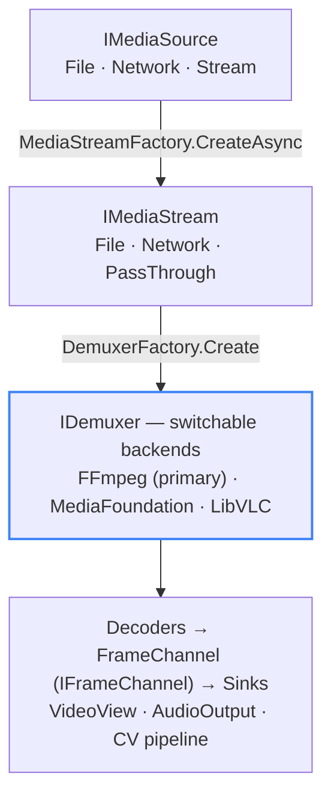
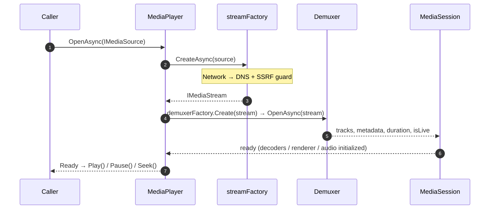

# Backends & Platform Roadmap

LingFan.Media drives playback through **pluggable backends**, all hidden behind the `Abstractions` interfaces. A fallback middleware (`IMediaPlayerFactory`) tries each registered backend in order and switches automatically when one fails. This page maps what is implemented today, what is only scaffolding, and the platform boundaries — including the status of **Linux** (no native backend, but playable via FFmpeg / VLC).

## Backend architecture

The pipeline never branches on *which* backend is active; backend selection is an implementation detail resolved by the fallback middleware.

> In plain words: any source becomes an `IMediaStream`, then a demuxer is chosen by the fallback middleware. Decoders emit frames through `IFrameChannel`, and sinks (video view, audio output, CV pipeline) consume them.

## Cross-platform backends (the guarantee)

FFmpeg and LibVLC are the **cross-platform safety net**. Both are LGPL-licensed and run on every target platform — **Windows, macOS, iOS, and Android** — so playback always works regardless of platform-native support. They are consumed purely through dynamic linking (see [Licensing](./licensing)).

| Backend | License | Platforms | Role | Status |
| --- | --- | --- | --- | --- |
| **FFmpeg** | LGPL 2.1+ (shared build) | Windows, macOS, iOS, Android | Primary demux / decode via `FFmpeg.AutoGen` | ✅ Implemented |
| **LibVLC / VLC** | LGPL 2.1+ | Windows, macOS, iOS, Android | Fallback backend, auto-switched by the middleware | ✅ Implemented |

Both already ship and work on Windows, macOS, iOS, and Android today. Linux is **not a targeted platform**, but because FFmpeg / LibVLC are cross-platform they still provide playback there — the exclusion applies only to building a *native* Linux backend.

## Platform-native backends (progressive integration)

Where a platform offers a first-party media API, LingFan.Media integrates it **progressively, one platform at a time** — not because the cross-platform backends are insufficient, but to use the most efficient OS-provided pipeline. Linux is the exception: it has **no standard first-party media API** (unlike Media Foundation, AVFoundation, or MediaCodec), so it is excluded from the native-backend roadmap by design.

| Platform | Native backend | Status |
| --- | --- | --- |
| **Windows** | Media Foundation (OS component) | ✅ Implemented — zero extra third-party licensing |
| **Apple (macOS / iOS)** | AVFoundation | Planned |
| **Android** | MediaCodec | Planned |
| **Linux** | — | Excluded — no standard native API (playable via FFmpeg / VLC) |

Today only Media Foundation is wired. AVFoundation and MediaCodec are on the roadmap; their absence does **not** block playback, because FFmpeg / LibVLC already cover those platforms.

## Not on the roadmap

| Project | Status | Note |
| --- | --- | --- |
| **GStreamer** | Empty scaffolding (0 source files) | Not planned |
| **WebRTC** | Stub (throws `PlatformNotSupportedException`) | Not planned |

## Platform roadmap

  

    V1 · now
    
<strong>Windows — implemented & tested.</strong> Media Foundation, FFmpeg, and LibVLC are all wired, together with D3D11 (+ DirectComposition) video and WASAPI audio. This is the first supported, tested surface.

  

  

    Next
    
<strong>macOS · iOS · Android.</strong> FFmpeg and LibVLC already provide working playback there today. Platform-native backends (AVFoundation, MediaCodec) will be integrated <strong>progressively over time</strong> — no new GPL code is introduced, since they ride on the existing LGPL cross-platform libraries.

  

  

    Excluded
    
<strong>Linux — excluded from the native-backend roadmap.</strong> Linux has no standard first-party media API (Media Foundation / AVFoundation / MediaCodec have no Linux equivalent), so LingFan.Media will not build a native Linux backend. That said, FFmpeg / LibVLC are cross-platform and <strong>do</strong> run on Linux, so playback still works there through them — they are the fallback. Linux is simply not a targeted or tested surface.

  

> **Scope note:** "supported platform" is the project's *targeted and tested* surface, distinct from the raw capability of the third-party libraries. Vulkan / OpenGL / Metal renderers exist as stubs / partials and are not part of the V1 supported surface.

## Open → Ready sequence (timing)

> Text summary: `OpenAsync` creates the stream, probes and opens the demuxer, builds the session, initializes the renderers, and finally reports ready. `Play`, `Pause`, and `Seek` only happen after that point.
