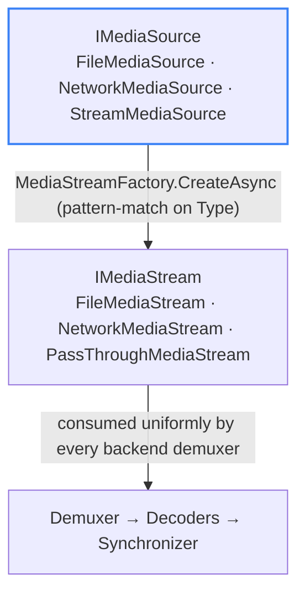

# Media Sources

A **media source** describes **what** to play — a local file, a remote URL, or an in-memory stream. It is fully decoupled from **how** it is read: the `MediaStreamFactory` turns any `IMediaSource` into an `IMediaStream`, and everything downstream (demuxer, decoders, synchronizer) is source-agnostic.

## Source types

| Source | Class | Stream produced | Status |
| --- | --- | --- | --- |
| **File** | `FileMediaSource` | `FileMediaStream` | ✅ Implemented — primary, most battle-tested |
| **Network** (HTTP / HTTPS) | `NetworkMediaSource` | `NetworkMediaStream` | 🟡 Implemented, **not yet tested** — async connect, SSRF guard, custom headers / cookies / timeout |
| **In-memory stream** | `StreamMediaSource` | `PassThroughMediaStream` | 🟡 Implemented, **not yet tested** — wraps any `System.IO.Stream` |

File is the reference path that has been exercised by the test suite. Network and Stream are fully written end-to-end (the code path exists and compiles), but they have **not yet been covered by tests** — treat them as experimental until validation lands.

All three are wired end-to-end: `MediaPlayer.OpenAsync(IMediaSource)` calls `streamFactory.CreateAsync(source)`, which returns an `IMediaStream` that every backend demuxer consumes uniformly. There is **no per-source branching** anywhere in the pipeline.

## How a source becomes a stream

## Implementation notes

- **`NetworkMediaSource`** includes built-in **SSRF protection**: it rejects `file://` and, by default, private / internal IP ranges. DNS resolution happens *before* the guard, with the resolved IP passed through to avoid a re-resolution window.
- **`StreamMediaSource`** hands an external `Stream` to the pipeline; thread-safety of that stream is the caller's responsibility.
- **`IsLive`** is derived from `source.Type == MediaSourceType.Network` at session creation.
- For non-seekable sources (live network streams, arbitrary `Stream`s), seeking support depends on what the underlying stream provides; `FileMediaSource` is the reference path for full seek / trick-play behavior.
