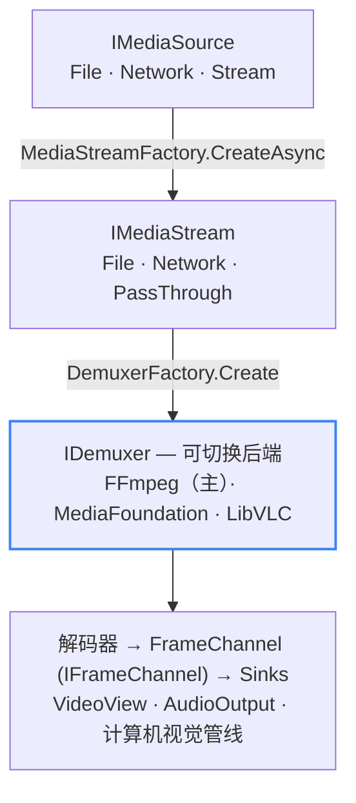
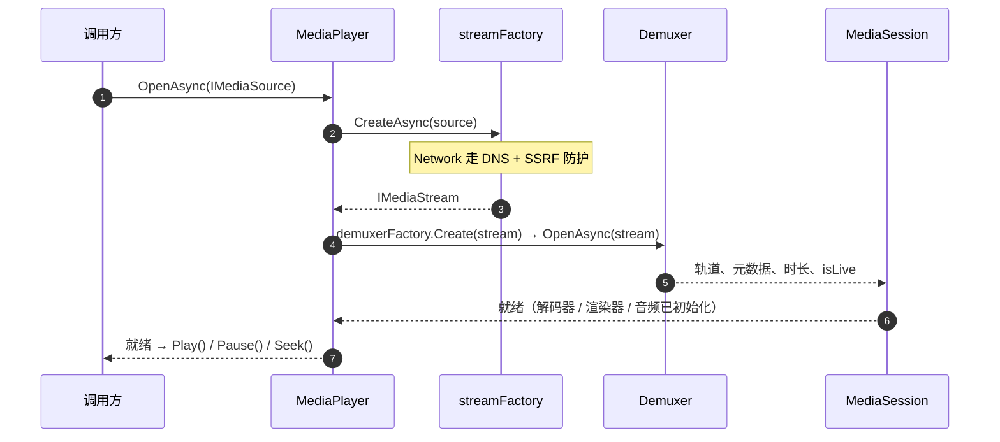

# 后端与平台路线

LingFan.Media 通过**可插拔后端**驱动播放，所有后端都隐藏在 `Abstractions` 接口之后。回退中间件（`IMediaPlayerFactory`）按 DI 注册顺序依次尝试各后端，并在某个后端失败时自动切换。本页梳理当前已实现的内容、仅剩脚手架的部分，以及平台边界——包括 **Linux 的状态**（无原生后端，但可经 FFmpeg / VLC 播放）。

## 后端架构

管线从不因「当前是哪个后端」而分支；后端选择是由回退中间件解决的纯实现细节。

> 文字版：任意源先变成 `IMediaStream`，再由回退中间件挑选 demuxer；解码器把帧投到 `IFrameChannel`，各 sink（视频视图、音频输出、CV 管线）统一消费。

## 跨平台后端（保底）

FFmpeg 与 LibVLC 是**跨平台保底**。二者均为 LGPL 授权，可在每一个目标平台运行——**Windows、macOS、iOS、Android**——因此无论平台原生支持如何，播放始终可用。它们仅以动态链接方式被消费（见[许可](./licensing)）。

| 后端 | 许可证 | 平台 | 角色 | 状态 |
| --- | --- | --- | --- | --- |
| **FFmpeg** | LGPL 2.1+（共享构建） | Windows、macOS、iOS、Android | 主解封装 / 解码，经 `FFmpeg.AutoGen` | ✅ 已实现 |
| **LibVLC / VLC** | LGPL 2.1+ | Windows、macOS、iOS、Android | 回退播放后端，由中间件自动切换 | ✅ 已实现 |

二者今天已在 Windows、macOS、iOS、Android 上发布并可用。Linux **不是目标平台**，但因 FFmpeg / LibVLC 跨平台，它们仍可在那里提供播放——「排除」仅针对构建*原生* Linux 后端。

## 各后端 GPU 零拷贝能力

零拷贝指解码出的 GPU 纹理不经过 CPU 回拷、直接交给渲染器上屏。由于帧路由与后端无关，该能力取决于解码后端能否暴露可被导入的 GPU 纹理：

| 后端 | 硬件解码 | GPU 零拷贝 | 说明 |
| --- | --- | --- | --- |
| **FFmpeg** | 是（Windows 上 D3D11VA / DXVA2） | **是**（Windows：D3D11、Vulkan、OpenGL） | 解码帧导出为 D3D11 共享纹理并由渲染器导入。已在 Windows 验证，含混合显卡场景——此时 Vulkan 设备对齐到 D3D11 默认适配器。 |
| **Media Foundation** | 是（DXVA2 / D3D11VA） | 否 | MFT 管线不暴露可外部导入的共享纹理，因此帧经 CPU 内存拷贝。 |
| **LibVLC / VLC** | 是 | 否（3.x 下） | `libvlc_video_set_callbacks` API 交付 CPU 像素。真·零拷贝需要 libvlc 4.0 的 output-callbacks API，目前尚未采用。 |

## 平台原生后端（逐步集成）

当某平台提供第一方媒体 API 时，LingFan.Media 会**按平台逐步集成**——这不是因为跨平台后端不够用，而是为了使用最高效、由操作系统提供的管线。Linux 是例外：它**没有标准的第一方媒体 API**（不像 Media Foundation、AVFoundation 或 MediaCodec），因此按设计排除在原生后端路线之外。

| 平台 | 原生后端 | 状态 |
| --- | --- | --- |
| **Windows** | Media Foundation（操作系统内置组件） | ✅ 已实现——无需额外第三方授权 |
| **Apple（macOS / iOS）** | AVFoundation | 计划中 |
| **Android** | MediaCodec | 计划中 |
| **Linux** | — | 已排除——无标准原生 API（可经 FFmpeg / VLC 播放） |

目前只有 Media Foundation 已接入。AVFoundation 与 MediaCodec 在路线之上；它们的缺失**不会**阻塞播放，因为 FFmpeg / LibVLC 已覆盖这些平台。

## 不在路线中

| 工程 | 状态 | 说明 |
| --- | --- | --- |
| **GStreamer** | 空脚手架（0 个源文件） | 不计划 |
| **WebRTC** | 存根（抛出 `PlatformNotSupportedException`） | 不计划 |

## 平台路线

  

    V1 · 现在
    
<strong>Windows — 已实现并测试。</strong> Media Foundation、FFmpeg、LibVLC 均已接入，配合 D3D11（+ DirectComposition）视频与 WASAPI 音频。这是第一个受支持且已测试的表面。

  

  

    下一阶段
    
<strong>macOS · iOS · Android。</strong> FFmpeg 与 LibVLC 今天已在这些平台提供可用播放。平台原生后端（AVFoundation、MediaCodec）将**随时间逐步集成**——不引入新的 GPL 代码，因为它们建立在已有的 LGPL 跨平台库之上。

  

  

    已排除
    
<strong>Linux —— 排除在原生后端路线之外。</strong> Linux 没有标准的第一方媒体 API（Media Foundation / AVFoundation / MediaCodec 在 Linux 上无对应物），因此 LingFan.Media 不会为 Linux 构建原生后端。不过，FFmpeg / LibVLC 是跨平台的，<strong>确实</strong>可在 Linux 上运行，所以播放仍经它们实现——它们即为保底。Linux 只是不被作为目标或已测试的表面。

  

> **范畴说明：**「受支持平台」指项目*目标并已测试*的表面，区别于第三方库本身的技术能力。**Vulkan** 渲染器已在 Windows 的 FFmpeg 零拷贝路径上验证，但不属于 V1 受支持表面；OpenGL / Metal 仍为部分实现。

## 打开 → 就绪 时序

> 文字摘要：`OpenAsync` 先创建流，再探测并打开 demuxer，构建 MediaSession，初始化渲染器，最后报告就绪。`Play`、`Pause`、`Seek` 只在此之后发生。
