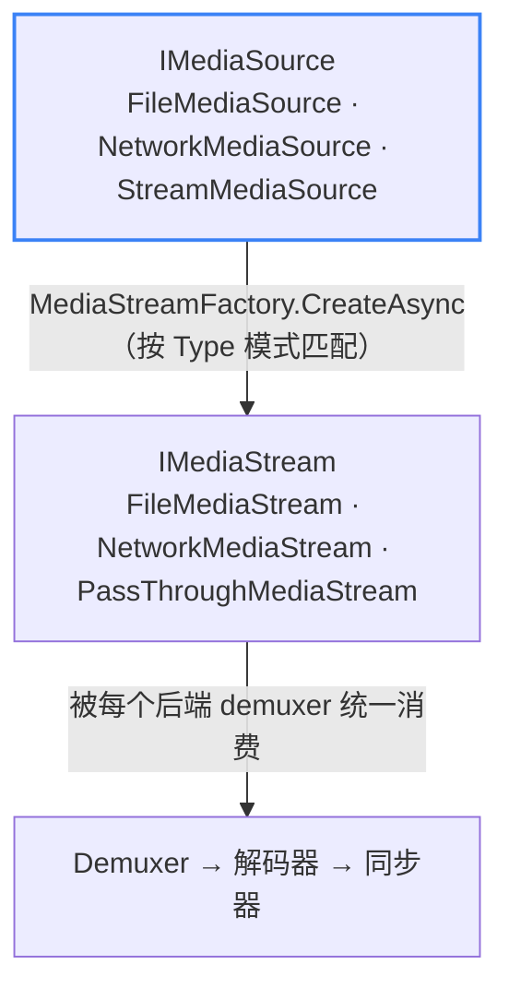

# 媒体源

**媒体源**描述**要播放什么**——本地文件、远程 URL，还是内存中的流。它与**如何读取**完全解耦：`MediaStreamFactory` 把任意 `IMediaSource` 转换为 `IMediaStream`，其后的所有环节（解封装、解码、同步器）都与源无关。

## 源类型

| 源 | 类 | 产出的流 | 状态 |
| --- | --- | --- | --- |
| **文件** | `FileMediaSource` | `FileMediaStream` | ✅ 已实现——主要路径，经测试最充分 |
| **网络**（HTTP / HTTPS） | `NetworkMediaSource` | `NetworkMediaStream` | 🟡 已实现，**尚未测试**——异步建连、SSRF 防护、自定义请求头 / Cookie / 超时 |
| **内存流** | `StreamMediaSource` | `PassThroughMediaStream` | 🟡 已实现，**尚未测试**——包装任意 `System.IO.Stream` |

文件是已被测试套件覆盖的参考路径。网络与内存流均已端到端写入（代码路径存在且可编译），但**尚未被测试覆盖**——在验证落地前，请将其视为实验性。

三者均已端到端打通：`MediaPlayer.OpenAsync(IMediaSource)` 调用 `streamFactory.CreateAsync(source)`，返回每个后端 demuxer 都统一消费的 `IMediaStream`。管线中**不存在按源分支**的逻辑。

## 源如何变为流

## 实现说明

- **`NetworkMediaSource`** 内置 **SSRF 防护**：拒绝 `file://`，默认拒绝私网 / 内网 IP 段。DNS 解析在防护校验之前完成，并把解析出的 IP 透传下去以避免二次解析窗口。
- **`StreamMediaSource`** 把一个外部 `Stream` 交给管线；该流的线程安全性由调用方保证。
- **`IsLive`** 在会话创建时由 `source.Type == MediaSourceType.Network` 推导得出。
- 对于不可定位的源（直播网络流、任意 `Stream`），是否支持拖动取决于底层流的能力；`FileMediaSource` 是完整拖动 / 特技播放的参考路径。
